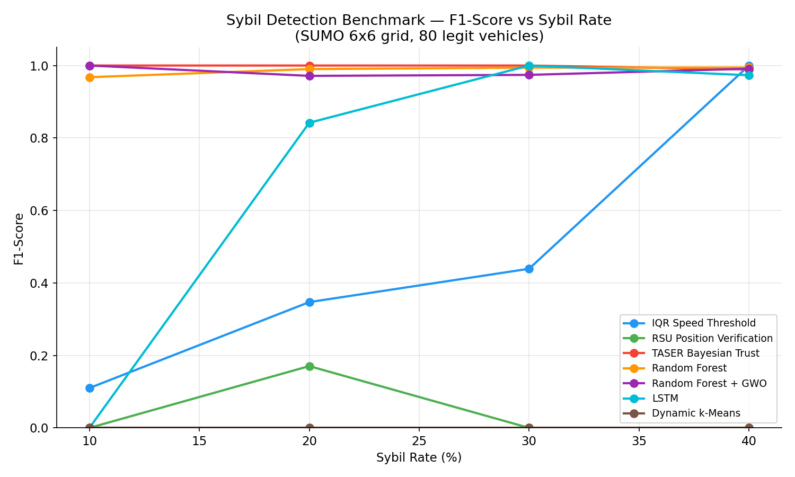
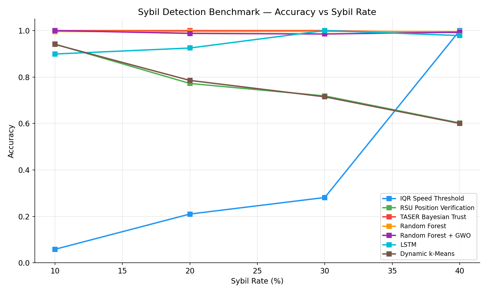
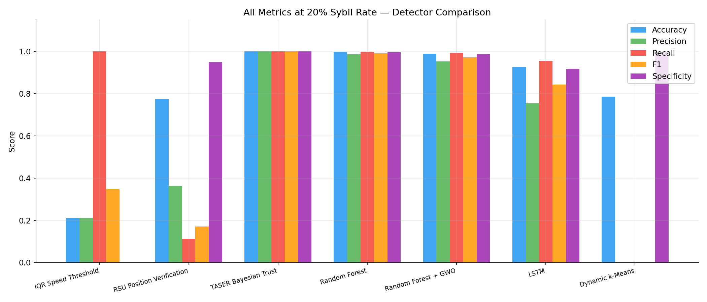
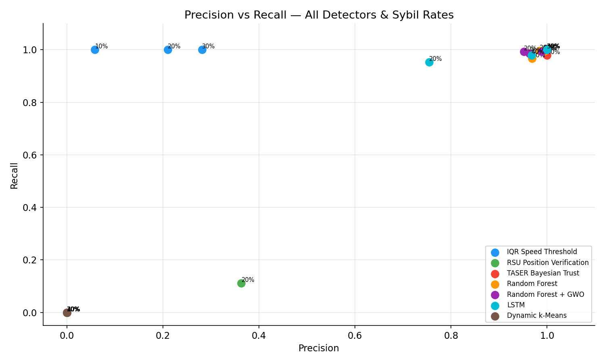

# VANET Sybil Detection — Unified Benchmark

Comparative benchmark of **7 Sybil attack detection algorithms** evaluated under identical simulation conditions. All detectors consume the same SUMO-generated dataset, enabling a fair apples-to-apples comparison.

---

## Motivation

Prior work evaluates each algorithm in its own simulator, network topology, and attack model, making cross-paper comparison unreliable. This benchmark fixes the simulation layer and varies only the detection algorithm.

---

## Simulation Setup

| Parameter | Value |
|---|---|
| Simulator | SUMO 1.12.0 (headless, via TraCI) |
| Network | 6×6 grid, 200 m cell spacing (1200×1200 m²) |
| Legitimate vehicles | 80 |
| Sybil rates tested | 10%, 20%, 30%, 40% |
| Simulation duration | 500 steps (1 step = 1 s) |
| RSUs | 20 fixed (4×5 grid) |
| Communication range | 150 m |
| Random seed | 42 (fully reproducible) |

### Sybil Attack Model

Five physical attacker devices each control multiple fake identities:

- **Co-location**: all fake IDs from the same attacker report the same physical position
- **Speed injection**: Sybil beacons inject Gaussian noise (σ = 8 m/s) to reported speed, producing values outside the legitimate range [0, 14 m/s]
- **Identity persistence**: each Sybil ID maintains its fake identity throughout the simulation

### Features Collected per Vehicle per Step

`step`, `vehicle_id`, `x`, `y`, `speed`, `accel`, `angle`, `edge_id`, `n_neighbors`, `min_rsu_dist`, `mean_rsu_dist`, `is_sybil`, `attacker_id`

---

## Detectors

| # | Detector | Category | Algorithm source |
|---|---|---|---|
| 1 | **IQR Speed Threshold** | Statistical | [MohammedSuratwala/SybilDetection](https://github.com/MohammedSuratwala/SybilDetection) |
| 2 | **RSU Position Verification** | Positional | [karthik-047/Detecting-Sybil-Attacks-in-VANETs](https://github.com/karthik-047/Detecting-Sybil-Attacks-in-VANETs) |
| 3 | **TASER Bayesian Trust** | Probabilistic | [morton-t/VANET-Simulations](https://github.com/morton-t/VANET-Simulations) |
| 4 | **Random Forest** | ML supervised | [126160042-crypto/sybil-attack-detection-vanet](https://github.com/126160042-crypto/sybil-attack-detection-vanet) |
| 5 | **Random Forest + GWO** | ML optimized | [126160042-crypto/sybil-attack-detection-vanet](https://github.com/126160042-crypto/sybil-attack-detection-vanet) |
| 6 | **LSTM** | Deep learning | [SaiKumar-1608/Dual-Layer-Framework](https://github.com/SaiKumar-1608/A-Dual-Layer-Sybil-Attack-Detection-Framework-for-RSU-less-VANETs-Using-Machine-Learning-and-POL) |
| 7 | **Dynamic k-Means** | Clustering | [Gideon-Adele/Dynamic-k-means-Clustering](https://github.com/Gideon-Adele/Dynamic-k-means-Clustering) |

---

## Results

### Mean metrics across all sybil rates (10–40%)

| Detector | Accuracy | Precision | Recall | F1-Score | Specificity |
|---|---|---|---|---|---|
| **TASER Bayesian Trust** | **0.9979** | **1.0000** | 0.9946 | **0.9973** | **1.0000** |
| **Random Forest** | 0.9961 | 0.9853 | **0.9880** | 0.9866 | 0.9968 |
| **Random Forest + GWO** | 0.9915 | 0.9760 | 0.9927 | 0.9842 | 0.9912 |
| LSTM | 0.9506 | 0.6804 | 0.7330 | 0.7038 | 0.9626 |
| IQR Speed Threshold | 0.3874 | 0.3874 | 1.0000 | 0.4740 | 0.2500 |
| RSU Position Verification | 0.7588 | 0.0908 | 0.0278 | 0.0426 | 0.9870 |
| Dynamic k-Means | 0.7602 | 0.0000 | 0.0000 | 0.0000 | 0.9960 |

### Per-sybil-rate F1-Score

| Detector | 10% | 20% | 30% | 40% |
|---|---|---|---|---|
| TASER Bayesian Trust | 1.0000 | 1.0000 | 1.0000 | 0.9892 |
| Random Forest | 0.9678 | 0.9902 | 0.9942 | 0.9944 |
| Random Forest + GWO | 1.0000 | 0.9715 | 0.9742 | 0.9912 |
| LSTM | 0.0000 | 0.8421 | 1.0000 | 0.9732 |
| IQR Speed Threshold | 0.1100 | 0.3471 | 0.4391 | 1.0000 |
| RSU Position Verification | 0.0000 | 0.1705 | 0.0000 | 0.0000 |
| Dynamic k-Means | 0.0000 | 0.0000 | 0.0000 | 0.0000 |









---

## Analysis

### Top tier — F1 ≥ 0.98

**TASER Bayesian Trust** achieves the best overall result (F1 = 0.997). It detects speed inconsistencies through Bayesian trust updates: every beacon with a speed outside the expected range decays the sender's trust score below the detection threshold. Because our attack model injects speed noise (σ = 8 m/s), TASER is extremely sensitive and precise (Precision = 1.0 across all rates).

**Random Forest** (F1 = 0.987) and **RF + GWO** (F1 = 0.984) are close behind. The supervised ML approaches learn all discriminative features simultaneously — speed, acceleration, position, neighbor count, RSU distance — producing robust classification. Notably, RF baseline slightly outperforms RF + GWO: GWO with 6 agents and 10 iterations does not consistently improve upon the default hyperparameters and adds 88–134 seconds of optimization overhead per scenario.

### Mid tier — F1 ≈ 0.70

**LSTM** (F1 = 0.704) shows high variance: it fails completely at 10% sybil rate (too few positive examples to learn temporal patterns) but achieves F1 = 1.0 at 30% and 0.97 at 40%. With sufficient Sybil prevalence the temporal sequence model captures the periodic anomalous speed pattern effectively.

### Low tier — F1 < 0.50

**IQR Speed Threshold** (F1 = 0.474) has perfect recall (1.0) but low precision — it flags essentially every vehicle as Sybil at low Sybil rates, producing a specificity of 0.0 at 10–30%. At 40% it achieves perfect F1 because the Sybil majority shifts the IQR fence enough to distinguish the two populations cleanly.

**RSU Position Verification** (F1 = 0.043) is fundamentally mismatched to our attack model. The RSU algorithm flags vehicle *pairs* that are simultaneously seen by the same RSU but claim positions > 150 m apart. Our Sybil nodes report the *same* position (co-location), so their inter-pair distance is ≈ 0 m — below the threshold. The algorithm is designed for an attack where the Sybil device *broadcasts different positions simultaneously*, not for position-sharing attacks.

**Dynamic k-Means** (F1 = 0.0) cannot separate the classes. Unsupervised clustering on aggregated vehicle statistics groups vehicles by driving pattern (speed range, area covered), but Sybil vehicles with injected noise end up in clusters of varying size that do not map cleanly to the Sybil label.

### Computational cost

| Detector | Mean fit time (s) |
|---|---|
| IQR Speed Threshold | 0.05 |
| Dynamic k-Means | 0.65 |
| TASER Bayesian Trust | 0.87 |
| Random Forest | 0.57 |
| LSTM | 10.0 |
| RSU Position Verification | 11.3 |
| Random Forest + GWO | 117.0 |

---

## Reproducing

### Requirements

```
Python 3.11+
SUMO 1.12.0  (set SUMO_HOME)
scikit-learn >= 1.0
tensorflow >= 2.11
lightgbm
pandas, numpy, matplotlib
```

```bash
pip install scikit-learn tensorflow lightgbm pandas numpy matplotlib
```

### Steps

```bash
# 1 — Generate SUMO network
netgenerate --grid --grid.number=6 --grid.length=200 \
    --default.speed=13.89 --output-file=simulation/network.net.xml

# 2 — Generate route files (all 4 sybil rates)
python simulation/generate_routes.py

# 3 — Generate SUMO config files
python simulation/make_configs.py

# 4 — Run simulations and collect datasets (~30 s)
python simulation/collect_dataset.py

# 5 — Run benchmark (~10 min due to GWO + LSTM)
python benchmark.py
```

Results are saved to `results/metrics/benchmark_results.csv` and figures to `figures/`.

---

## Repository Structure

```
vanet-benchmark/
├── simulation/
│   ├── network.net.xml              # SUMO 6x6 grid network
│   ├── routes_sybil{10,20,30,40}.rou.xml
│   ├── scenario_sybil{10,20,30,40}.sumocfg
│   ├── generate_routes.py           # route file generator
│   ├── make_configs.py              # SUMO config generator
│   └── collect_dataset.py           # TraCI feature extractor
├── detectors/
│   ├── base_detector.py             # abstract base class
│   ├── iqr_detector.py
│   ├── rsu_detector.py
│   ├── taser_detector.py
│   ├── rf_detector.py
│   ├── gwo_rf_detector.py
│   ├── lstm_detector.py
│   └── kmeans_detector.py
├── benchmark.py                     # orchestrator + figures
├── results/
│   ├── datasets/                    # dataset_sybil{N}.csv
│   └── metrics/benchmark_results.csv
└── figures/                         # PNG charts (150 dpi)
```
