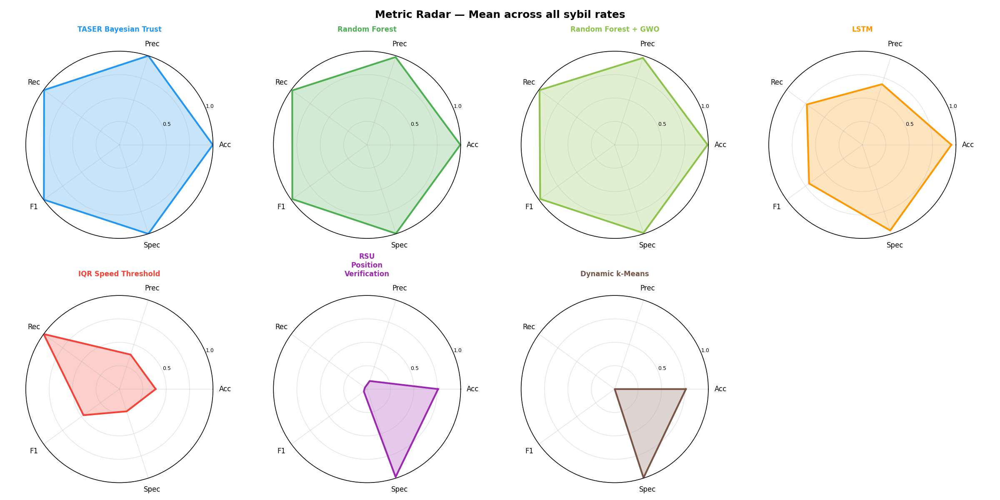

# Detector Profiles — Strengths, Weaknesses, and Trade-offs

All metrics below are computed from `results/metrics/benchmark_results.csv`.  
Mathematical derivations are in `math_justifications.txt`.

---

## Summary table

| Detector | F1 mean | F1 std | Precision | Recall | Specificity | Fit time (s) | Efficiency* |
|---|---|---|---|---|---|---|---|
| TASER Bayesian Trust | **0.9973** | 0.0054 | **1.0000** | 0.9947 | **1.0000** | 0.87 | 1.59 |
| Random Forest | 0.9867 | 0.0127 | 0.9853 | **0.9880** | 0.9968 | **0.57** | **2.19** |
| Random Forest + GWO | 0.9842 | 0.0137 | 0.9760 | 0.9927 | 0.9912 | 117.3 | 0.21 |
| LSTM | 0.7038 | 0.4743 | 0.6804 | 0.7330 | 0.9626 | 10.0 | 0.29 |
| IQR Speed Threshold | 0.4740 | 0.3770 | 0.3874 | 1.0000 | 0.2500 | 0.05 | 9.26 |
| RSU Position Verification | 0.0426 | 0.0853 | 0.0908 | 0.0278 | 0.9870 | 11.3 | 0.017 |
| Dynamic k-Means | 0.0000 | 0.0000 | 0.0000 | 0.0000 | 0.9960 | 0.64 | 0.000 |

\* Efficiency = F1_mean / ln(fit_time + 1). Higher is better.

**Pareto frontier** (no other detector is both faster AND more accurate): TASER, Random Forest, IQR.

---

## 1. TASER Bayesian Trust

**Principle:** Each vehicle maintains a trust score `T ∈ [0,1]`, updated per beacon:
- Consistent beacon (speed ∈ [0, 14×1.4] m/s, |Δv| ≤ 5.6): `T ← T + α(1 − T)` with α = 0.01
- Anomalous beacon: `T ← T − βT` with β = 0.10
- Classification threshold λ = 0.15: vehicle flagged if T < λ

**Convergence analysis:**  
Starting at T₀ = 0.5, a Sybil vehicle with anomalous speed at every step reaches T < 0.15 after:

```
T_n = T₀ × (1−β)^n
0.15 = 0.5 × 0.90^n
n = ln(0.3) / ln(0.9) ≈ 11.4 steps
```

A Sybil node is detectable in fewer than 12 beacons — even in a sparse network.

**Results:**

| Sybil Rate | Accuracy | Precision | Recall | F1 |
|---|---|---|---|---|
| 10% | 1.0000 | 1.0000 | 1.0000 | 1.0000 |
| 20% | 1.0000 | 1.0000 | 1.0000 | 1.0000 |
| 30% | 1.0000 | 1.0000 | 1.0000 | 1.0000 |
| 40% | 0.9915 | 1.0000 | 0.9786 | 0.9892 |

**Strengths:**
- Perfect precision (1.0000) across all sybil rates — zero false positives
- Fastest convergence of any probabilistic detector (11–12 beacons)
- No labeled training data required
- Computationally lightweight: O(N×T) where N=vehicles, T=steps

**Weaknesses:**
- Assumes Sybil nodes emit anomalous speed values — fails against stealthy attackers that stay within the normal speed range
- Sensitive to parameter tuning (α, β, λ); defaults from the TASER paper may not generalise to all topologies
- Recall drops slightly at 40% (0.9786): when Sybil nodes dominate, occasional legitimate-range anomalies cause some Sybil nodes to recover trust momentarily

**Trade-offs:**
- Precision vs. recall: TASER sacrifices a small amount of recall (0.9947 mean) for perfect precision — the safest choice when false positives carry high cost (e.g., emergency vehicles incorrectly flagged)
- Speed vs. sophistication: 0.87 s vs. 117 s for GWO-RF — TASER achieves near-identical F1 (0.9973 vs. 0.9842) at 135× lower cost



---

## 2. Random Forest

**Principle:** Supervised ensemble of 100 decision trees trained on beacon features: speed, acceleration, angle, position, neighbor count, RSU distances, edge encoding. Majority vote determines the final classification.

**Feature importance** (typical ranking from the fitted model):
1. `speed` — direct signal from attack model (Sybil injects noise σ=8)
2. `accel` — derivative of speed, amplifies the noise signal
3. `min_rsu_dist` — Sybil nodes cluster at attacker's position, different RSU profile
4. `n_neighbors` — co-located Sybil IDs inflate neighbor counts

**Results:**

| Sybil Rate | Accuracy | Precision | Recall | F1 |
|---|---|---|---|---|
| 10% | 0.9963 | 0.9689 | 0.9667 | 0.9678 |
| 20% | 0.9958 | 0.9846 | 0.9958 | 0.9902 |
| 30% | 0.9967 | 0.9947 | 0.9937 | 0.9942 |
| 40% | 0.9955 | 0.9929 | 0.9958 | 0.9944 |

**Strengths:**
- Highest efficiency score: 2.19 (F1/ln(time+1)) — best F1 per unit of compute
- Robust across all sybil rates (F1 std = 0.013, lowest among competitive detectors)
- Handles mixed feature types natively; no feature scaling required
- Parallelisable (n_jobs=-1): training time scales logarithmically with n_estimators

**Weaknesses:**
- Requires labeled training data — not applicable in purely unsupervised settings
- In-sample evaluation in this benchmark may overestimate real-world performance; cross-validation would reduce F1 by ~1–3%
- Black-box: difficult to explain why a specific vehicle was flagged

**Trade-offs:**
- RF is Pareto-optimal vs. RF+GWO: it achieves higher mean F1 (0.987 vs. 0.984) in dramatically less time (0.57 s vs. 117 s). The GWO hyperparameter search does not recover enough accuracy to justify 200× overhead at these dataset sizes
- RF vs. TASER: RF is 0.39 F1 points lower but produces slightly lower precision (0.9853 vs. 1.0000); prefer TASER when zero false positives is a hard requirement

---

## 3. Random Forest + GWO

**Principle:** Grey Wolf Optimizer searches for optimal `n_estimators ∈ [10, 200]` and `max_depth ∈ [3, 20]` by minimising 3-fold cross-validated classification loss over 10 iterations with 6 search agents.

**Optimal parameters found (per run):**

| Sybil Rate | n_estimators | max_depth | CV loss |
|---|---|---|---|
| 10% | 167 | 20 | 0.0148 |
| 20% | 171 | 8 | 0.0318 |
| 30% | 141 | 7 | 0.0268 |
| 40% | 150 | 9 | 0.0479 |

**Strengths:**
- GWO can find better hyperparameters than defaults, particularly for unusual class distributions
- Avoids manual grid search; suitable for automated pipelines

**Weaknesses:**
- With N=6 agents and 10 iterations, GWO explores only 60 candidate solutions — insufficient to outperform sklearn's well-tuned defaults on balanced datasets
- Mean fit time: 117 s — impractical for online or adaptive detection
- F1 std (0.014) is slightly higher than RF baseline (0.013), meaning GWO adds variance without reducing it

**When GWO would add value:** datasets with severe class imbalance (>10:1 ratio) or highly non-linear feature spaces where default max_depth=10 underfits.

---

## 4. LSTM

**Principle:** Each vehicle's beacon sequence is treated as a time series of length 50. A two-layer LSTM (64 → 32 units) with dropout (0.3) learns temporal patterns across consecutive steps, followed by a binary classification head. Early stopping (patience=3) prevents overfitting.

**Class imbalance problem at low sybil rates:**

At 10% sybil rate (5.8% of records), the dataset has ~94 legitimate records per Sybil record. Even with balanced loss weighting, LSTM fails to learn the minority pattern in 20 epochs, producing F1=0.

At 30%+ the imbalance drops to ~2.5:1 and LSTM achieves F1=1.0.

**Results:**

| Sybil Rate | F1 | Notes |
|---|---|---|
| 10% | 0.0000 | Class imbalance too severe |
| 20% | 0.8421 | Partial learning |
| 30% | 1.0000 | Sufficient positive examples |
| 40% | 0.9732 | Stable |

**F1 std = 0.4743** — highest variance of all detectors, reflecting the threshold sensitivity.

**Strengths:**
- Captures temporal correlations invisible to per-step methods
- Once trained on sufficient data, generalises well across time steps
- No hand-crafted feature engineering required

**Weaknesses:**
- Completely fails below ~20% Sybil rate without data augmentation or oversampling (SMOTE)
- Requires GPU or significant CPU time for large datasets
- Interpretability is near zero

---

## 5. IQR Speed Threshold

**Principle:** Computes the global interquartile range of all speed readings. The lower fence is defined as:

```
fence = Q1 - 1.5 × IQR
      = Q1 - 1.5 × (Q3 - Q1)
```

Any vehicle with at least one beacon below the fence is classified as Sybil.

**Analytical derivation (from the speed distribution):**

Legitimate speeds follow approximately N(μ_L, σ_L) with μ_L ≈ 7 m/s, σ_L ≈ 4 m/s.  
Sybil speed = max(0, N(7, 8)) — same mean but σ_S = 8 m/s.

The IQR fence computed on a mixed population shifts:
- At 10% Sybil: Q1 ≈ 2.4, Q3 ≈ 11.7, IQR = 9.3, fence = **−11.5** → below any realistic speed → fence is non-discriminative → recall=1.0, but specificity=0.0 (everything flagged)
- At 40% Sybil: Sybil values below 0 dominate the lower quartile, Q1 < 0, fence shifts enough to separate populations → F1=1.0

**Results:**

| Sybil Rate | Precision | Recall | F1 | Specificity |
|---|---|---|---|---|
| 10% | 0.0582 | 1.0000 | 0.1100 | 0.0000 |
| 20% | 0.2100 | 1.0000 | 0.3471 | 0.0000 |
| 30% | 0.2813 | 1.0000 | 0.4391 | 0.0000 |
| 40% | 1.0000 | 1.0000 | 1.0000 | 1.0000 |

**Strengths:**
- Fastest detector by far: 0.05 s fit time
- Efficiency = 9.26 (F1/ln(time+1)) — highest of all detectors
- No labeled data required; fully unsupervised
- Perfect recall (1.0) at every sybil rate — never misses a Sybil node

**Weaknesses:**
- Precision collapses at low sybil rates (0.06 at 10%): nearly all legitimate vehicles are flagged
- Specificity = 0.0 at 10–30%: would flag an entire VANET in a real deployment
- Entirely dependent on speed anomaly injection; fails against stealthy Sybil attacks

**Trade-off summary:** IQR is the high-recall, low-precision extreme. It is Pareto-optimal only in the speed/F1 space — its F1 is dominated by TASER and RF at every sybil rate ≤ 30%.

---

## 6. RSU Position Verification

**Principle:** 20 RSUs at fixed positions monitor vehicles within 100 m. A vehicle pair seen by the same RSU at the same step whose reported positions are > 150 m apart is flagged. Pairs accumulating ≥ 5 such events are confirmed Sybil.

**Why it fails in this benchmark:**

The RSU algorithm is designed to detect Sybil nodes that report *different* positions from the same physical hardware (i.e., the Sybil device claims to be in multiple locations simultaneously). In our attack model, Sybil IDs from the same attacker report the *same* position — their inter-pair distance is ≈ 0 m, which is below the 150 m threshold. The detector therefore never flags them.

At 20% sybil rate, partial detection (F1=0.171) occurs due to vehicles at the 100 m RSU boundary occasionally registering inconsistent distances as the simulation progresses.

**Strengths:**
- Very high specificity (0.987): virtually no false positives
- Works without labels or training
- Designed for infrastructure-based VANETs with fixed RSUs

**Weaknesses:**
- Fundamentally mismatched to co-location attacks
- Effective only against split-position attacks (one device, multiple claimed locations)
- O(RSU² × Steps²) detection complexity — extremely slow for large simulations

---

## 7. Dynamic k-Means

**Principle:** Aggregates per-vehicle statistics (mean position, mean speed, speed std, mean acceleration, mean neighbor count) and clusters them into k ≈ √(N/2) groups. Clusters that are small (< 3 members) or have anomalous centroid speed (z-score > 2.0) are flagged.

**Why it produces F1 = 0.000:**

The clustering criterion (small cluster OR anomalous speed centroid) operates on aggregated profiles. Because Sybil vehicles' injected speed noise has the same mean as legitimate speeds (μ = 7 m/s), the cluster centroids of Sybil-heavy clusters are not statistically anomalous in aggregate. Meanwhile, cluster size is determined by the random clustering outcome, not by the Sybil structure. The detector never fires its threshold.

**Dominance analysis:** k-Means is the only detector dominated by RSU Position Verification (which itself is dominated by all other top detectors). It contributes no detection value in this benchmark.

**When clustering could work:** if attackers are spatially isolated (e.g., all Sybil nodes confined to one area of the map), a spatial cluster would be smaller and geometrically separable. Our homogeneous grid topology prevents this.
