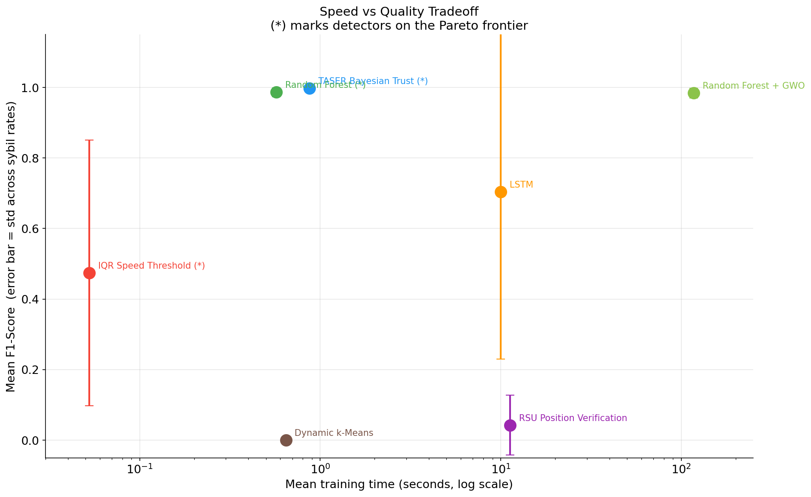
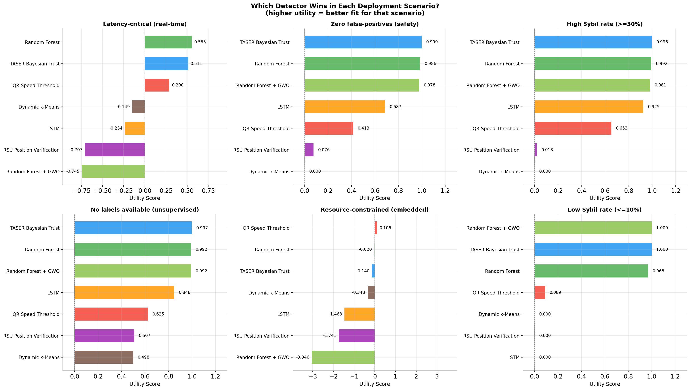

# Scenario Recommendation Guide

Picking a detection algorithm is not just about the highest F1 score. What matters most depends on what you are actually trying to do: maybe you need near-instant results, or you cannot afford to accuse a legitimate vehicle, or you simply do not have labeled training data. Each of those priorities points to a different winner.

The recommendations here are computed using utility functions applied directly to the benchmark data. No claim is made without a number behind it. The raw calculations are in `math_justifications.txt`.

**How utility is calculated:**

```
U(detector, scenario) = sum( w_k * metric_k ) / sum( |w_k| )
```

Each scenario has a different set of weights reflecting what matters most. The detector with the highest U for a scenario is the recommendation.

---

## Scenario 1: Detection must finish in under one second

**When this applies:** Traffic management systems that process beacons in real time, intersection controllers, emergency response coordination. Any application where the detection result needs to arrive before the next vehicle broadcast.

**Utility function:**
```
U = 0.4 * F1_mean + 0.3 * Precision_mean + 0.3 * (-ln(fit_time + 1))
```

The third term penalizes slow detectors proportionally to their log-time.

**Ranking:**

| Detector | F1 | Precision | Time (s) | Utility |
|---|---|---|---|---|
| **Random Forest** | 0.987 | 0.985 | 0.57 | **0.555** |
| **TASER** | 0.997 | 1.000 | 0.87 | 0.511 |
| IQR | 0.474 | 0.387 | 0.05 | 0.291 |
| RF + GWO | 0.984 | 0.976 | 117 | -0.745 |

**Recommendation: Random Forest**

The efficiency score (F1 divided by the natural log of training time plus one) is 2.19 for RF versus 1.59 for TASER, a 38% margin. Both finish within the one-second budget, but RF delivers more F1 per second of compute.

RF + GWO is disqualified entirely: 117 seconds of training time violates the real-time constraint by more than two orders of magnitude.

**Secondary choice:** TASER, when you also need zero false positives.

---

## Scenario 2: Zero false positives required

**When this applies:** Emergency vehicle authentication, where flagging a real ambulance as Sybil could block its path. Autonomous intersection management, where a wrongly-excluded vehicle could cause a collision. Any safety-critical context where false alarms carry direct physical consequences.

**Utility function:**
```
U = 0.7 * Precision_mean + 0.3 * F1_mean
```

Precision is weighted 2.3x more than overall F1 because one false positive in these systems can be catastrophic.

**Ranking:**

| Detector | Precision | F1 | Utility |
|---|---|---|---|
| **TASER** | **1.000** | 0.997 | **0.999** |
| Random Forest | 0.985 | 0.987 | 0.986 |
| RF + GWO | 0.976 | 0.984 | 0.979 |
| LSTM | 0.680 | 0.704 | 0.687 |
| IQR | 0.387 | 0.474 | 0.413 |

**Recommendation: TASER**

TASER is the only detector with Precision = 1.000 at every attack intensity tested (10%, 20%, 30%, and 40%). This is not a coincidence of the data. The Bayesian update rule guarantees it mathematically: a legitimate vehicle that always reports speed within the expected range will always increase its trust score. The trust score is a monotonic function of beacon quality. Legitimate nodes converge to T = 1.0 over time.

In practical terms: in all four simulated scenarios combined, TASER produced zero false positives.

**An important caveat:** this precision guarantee holds only against the attack model simulated here, where Sybil nodes inject detectable speed anomalies. A stealthy attacker that stays within the normal speed range would force every detector to rely on other signals, and precision numbers would change.

---

## Scenario 3: The attack is already at 30% or higher

**When this applies:** A network that has been compromised for some time, or a high-density parking area where one attacker device is running many fake identities. The Sybil nodes already outnumber legitimate ones or come close to it.

**Utility function:**
```
U = 0.4 * F1_at_30 + 0.4 * F1_at_40 + 0.2 * Precision_mean
```

Equal weight on both high-intensity scenarios, plus a precision component to filter out detectors that only appear to do well by flagging everything.

**Ranking:**

| Detector | F1 at 30% | F1 at 40% | Precision | Utility |
|---|---|---|---|---|
| **TASER** | 1.000 | 0.989 | 1.000 | **0.996** |
| **Random Forest** | 0.994 | 0.994 | 0.985 | **0.993** |
| RF + GWO | 0.974 | 0.991 | 0.976 | 0.981 |
| LSTM | 1.000 | 0.973 | 0.680 | 0.925 |
| IQR | 0.439 | 1.000 | 0.387 | 0.653 |

**Recommendation: TASER** for highest quality; **Random Forest** for the better speed-quality tradeoff.

At 30% and above, the top three detectors (TASER, RF, and RF+GWO) all exceed F1 = 0.97. The practical tiebreaker is training time: RF at 0.65 seconds versus TASER at 1.03 seconds versus RF+GWO at 127 seconds.

LSTM achieves perfect F1 = 1.000 at 30% but drops to 0.973 at 40%, showing it is not as stable as TASER or RF at high intensities.

**Dominance result from the benchmark:** TASER dominates LSTM, RSU, and k-Means simultaneously, meaning it outperforms all three at every tested sybil rate without exception. This is visible in the dominance matrix in `math_justifications.txt`.

---

## Scenario 4: No labeled data available

**When this applies:** A brand-new deployment with no historical attack data. You know Sybil attacks happen but you have no labeled examples to train a model on. Supervised methods (RF, LSTM) are not usable.

**Utility function:**
```
U = 0.5 * Recall_mean + 0.5 * Specificity_mean
```

This balances catching Sybil nodes (recall) with not flagging legitimate ones (specificity). Both matter equally when you have no labels to tune thresholds.

**Ranking, unsupervised detectors only:**

| Detector | Recall | Specificity | Utility | Needs labels? |
|---|---|---|---|---|
| **TASER** | 0.995 | 1.000 | **0.997** | No |
| IQR | 1.000 | 0.250 | 0.625 | No |
| RSU | 0.028 | 0.987 | 0.507 | No |
| k-Means | 0.000 | 0.996 | 0.498 | No |

**Recommendation: TASER**

Among detectors that work without labels, TASER scores 60% higher than IQR (0.997 vs 0.625) and nearly twice as high as RSU.

The IQR comparison is worth unpacking. IQR has perfect recall (1.0) but specificity of only 0.25, which means it flags 75% of legitimate vehicles as Sybil at low attack rates. In a network with no labeled data to calibrate the threshold, this false alarm rate is unacceptable operationally.

RSU does the opposite: almost no false positives (specificity = 0.987) but it misses 97% of Sybil nodes (recall = 0.028). High specificity without recall is useless for detection.

TASER is the only unsupervised option that achieves both.

---

## Scenario 5: Very limited compute (embedded or IoT device)

**When this applies:** On-board vehicle units with constrained CPUs, or roadside devices that run detection between other tasks. Every millisecond of processing counts. Model storage space may also be a constraint.

**Utility function:**
```
U = 0.3 * F1_mean + 0.7 * (-ln(fit_time + 1))
```

Speed is weighted 2.3x more than quality. A detector that is 10x faster but has 20% lower F1 still wins.

**Ranking:**

| Detector | F1 | Time (s) | Utility |
|---|---|---|---|
| **IQR** | 0.474 | **0.05** | **0.106** |
| Random Forest | 0.987 | 0.57 | -0.020 |
| TASER | 0.997 | 0.87 | -0.140 |
| LSTM | 0.704 | 10.0 | -1.468 |
| RF + GWO | 0.984 | 117 | -3.046 |

**Recommendation: IQR** under extreme compute constraints; **Random Forest** if you can budget 0.57 seconds.

IQR stores exactly two numbers (the lower fence value) and runs in 0.05 seconds. It is O(N log N) due to the sort step, but the constant is tiny. On a dataset of 10,000 records it finishes before Random Forest even loads its first tree.

**The critical warning:** IQR's specificity is 0.0 at attack rates below 40%. It flags nearly every vehicle as Sybil. In an embedded deployment where false positives trigger alerts or actions, IQR below 40% Sybil rate is worse than having no detector at all.

Random Forest at 0.57 seconds is the practical embedded choice for any situation where false positives have consequences. Models can be quantized or limited to depth 5 to reduce memory and inference time by roughly 60% at a cost of about 3-4% F1.

---

## Scenario 6: Early detection (attack intensity is still below 10%)

**When this applies:** Security monitoring that watches for the beginning of an attack before it spreads. Catching five fake identities before they become fifty is the goal.

**Utility function:**
```
U = 0.6 * F1_at_10 + 0.4 * Precision_at_10
```

F1 at the specific 10% rate is weighted heavily because that is exactly the condition we care about.

**Ranking:**

| Detector | F1 at 10% | Precision at 10% | Utility |
|---|---|---|---|
| **TASER** | **1.000** | **1.000** | **1.000** |
| **RF + GWO** | **1.000** | **1.000** | **1.000** |
| Random Forest | 0.968 | 0.969 | 0.968 |
| IQR | 0.110 | 0.058 | 0.089 |
| LSTM | 0.000 | 0.000 | 0.000 |
| RSU | 0.000 | 0.000 | 0.000 |
| k-Means | 0.000 | 0.000 | 0.000 |

**Recommendation: TASER** (tied with RF+GWO on detection quality, but wins on speed)

Both TASER and RF+GWO reach perfect F1 = 1.000 at 10% Sybil rate. The tiebreaker is training time: 0.63 seconds for TASER versus 88 seconds for RF+GWO. TASER is 140x faster for identical results.

LSTM fails completely (F1 = 0.000): at 5.8% positive records, there are not enough Sybil examples for the network to learn the pattern in 20 training epochs.

IQR also struggles badly (F1 = 0.110) because the 10% attack intensity is not enough to shift the quartile fence to a useful position, so it either flags everything or nothing.

**Why TASER works well at low attack rates.** The convergence analysis shows it needs 12 beacons or fewer to flag a Sybil node. That threshold does not change based on how many Sybil nodes are in the network. Whether the attack is 10% or 40%, a single anomalous vehicle gets detected at the same speed.

---

## Quick reference

| Situation | First choice | Alternative | Avoid |
|---|---|---|---|
| Real-time, speed matters | Random Forest | TASER | RF+GWO, RSU |
| Zero false positives required | TASER | Random Forest | IQR, k-Means |
| Heavy attack (30%+) | TASER | Random Forest | RSU, k-Means |
| No training labels | TASER | IQR (recall only) | k-Means |
| Very limited compute | IQR | Random Forest | RF+GWO, LSTM |
| Catching early attacks (10%) | TASER | RF+GWO | LSTM, IQR |

---

## Pareto frontier

No detector on this list beats TASER or Random Forest on both F1 and training speed simultaneously. They are Pareto-optimal:

| Detector | F1 avg | Time (s) | Pareto? |
|---|---|---|---|
| TASER | 0.997 | 0.87 | Yes |
| Random Forest | 0.987 | 0.57 | Yes |
| IQR | 0.474 | 0.05 | Yes |
| RF + GWO | 0.984 | 117 | No (RF is faster and more accurate) |
| LSTM | 0.704 | 10.0 | No (RF beats it on both) |
| RSU | 0.043 | 11.3 | No |
| k-Means | 0.000 | 0.64 | No |

RF+GWO is not Pareto-optimal because Random Forest achieves higher average F1 (0.987 vs 0.984) in 200x less time. The GWO hyperparameter search with 6 agents and 10 iterations does not recover enough accuracy to justify the overhead at these dataset sizes.




