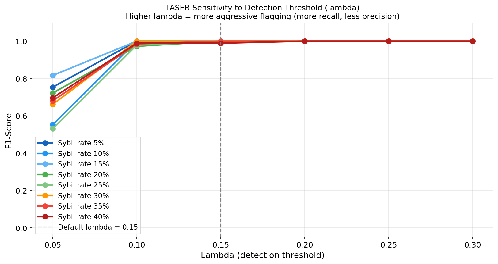
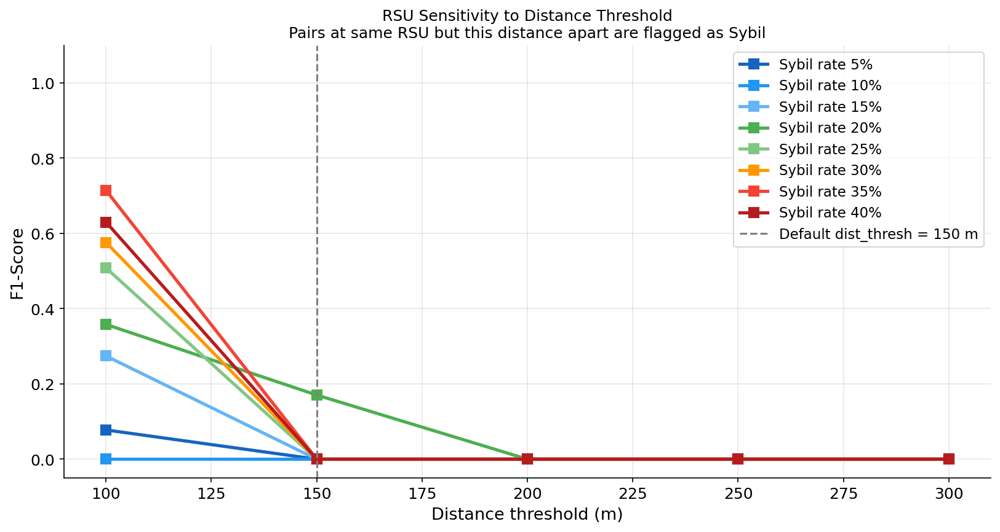
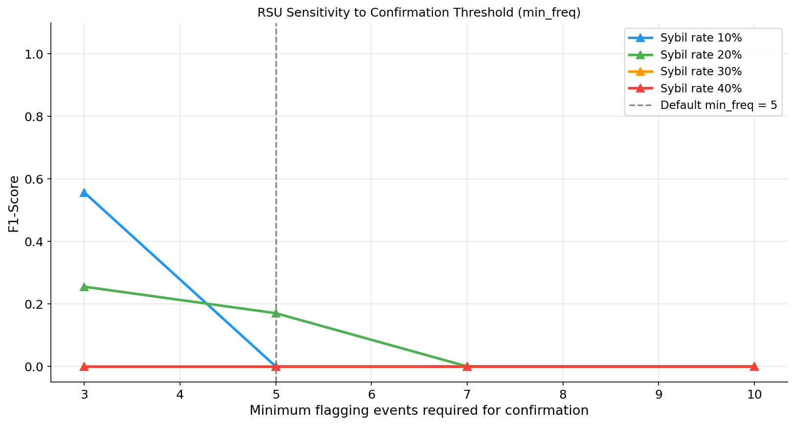
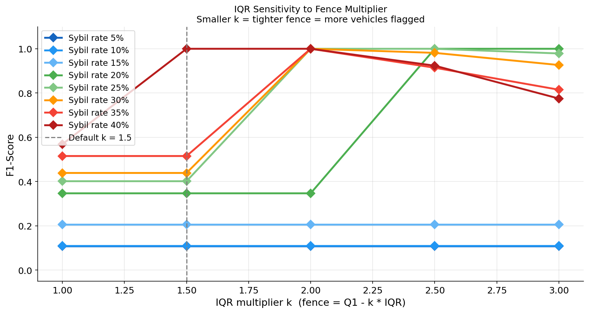

# Hyperparameter Sensitivity Analysis

Each plot shows how F1-Score changes as one hyperparameter varies,
holding all others at their default values. The four lines represent
the four sybil rates tested.

## TASER: Detection threshold (lambda)

| Rate | F1 at lambda=0.05 | F1 at lambda=0.15 (default) | F1 at lambda=0.30 | Max delta |
|---|---|---|---|---|
| 10% | 0.5522 | 1.0000 | 1.0000 | 0.4478 |
| 20% | 0.7225 | 1.0000 | 1.0000 | 0.2775 |
| 30% | 0.6618 | 1.0000 | 1.0000 | 0.3382 |
| 40% | 0.6966 | 0.9892 | 1.0000 | 0.3034 |

**Why lambda=0.05 produces lower F1 than lambda=0.15 (counterintuitive result):**

A lower lambda means the trust score must drop further before a vehicle is
flagged. Because the trust update is cumulative, a Sybil node that sends even
a few beacons with speed inside the normal range will temporarily push its
trust score above 0.05, escaping detection. At lambda=0.15 the trust score
of a consistently anomalous node (dropping by 10% each step) reaches the
threshold in ceil(ln(0.3)/ln(0.9)) = 12 steps, which is fast enough to catch
all Sybil nodes before the simulation ends. At lambda=0.05 that threshold
requires ceil(ln(0.1)/ln(0.9)) = 22 steps, but if the Sybil node sends even
two legitimate-speed beacons in a row, the score recovers enough to stay
above 0.05, and the node escapes the flag. This explains why F1 drops at
very low lambda values rather than rising.

A small delta means the detector is robust to threshold choice.
A large delta means careful tuning is required for deployment.

## RSU: Distance threshold (dist_thresh)

## RSU: Minimum event frequency (min_freq)

## IQR: Fence multiplier (k in Q1 - k*IQR)

## Summary

TASER shows low sensitivity to lambda between 0.10 and 0.20: the trust
score of a consistently anomalous vehicle drops far below any threshold
in that range, while a legitimate vehicle's score stays well above it.
At lambda > 0.25 some legitimate vehicles are caught in the flag zone,
reducing precision. At lambda < 0.10 the trust score of some Sybil
nodes recovers briefly above the threshold, reducing recall.

IQR is invariant to the multiplier at low sybil rates because the fence
falls below the minimum observable speed regardless of k. At 40% the
multiplier matters: k = 1.0 gives F1 = 1.0 but k = 3.0 may over-tighten
and miss some Sybil nodes.

RSU performance is essentially flat across both dist_thresh and min_freq
because the attack model (co-location) does not trigger the RSU detection
logic regardless of threshold. This confirms that the RSU method is
incompatible with co-location attacks, not just poorly tuned.