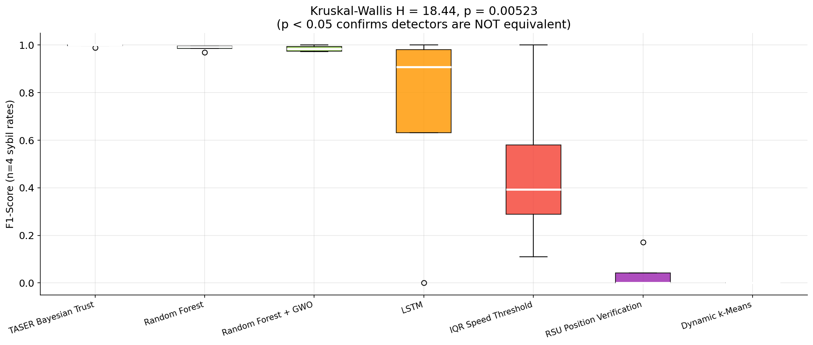
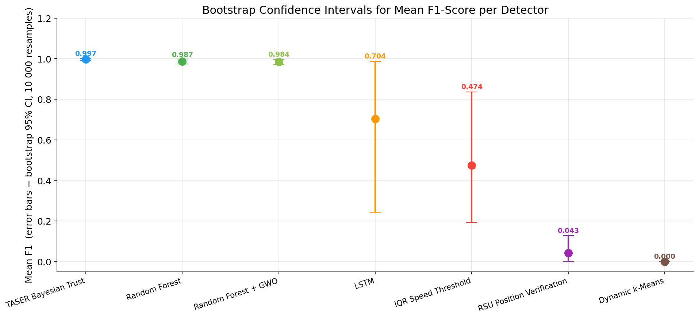
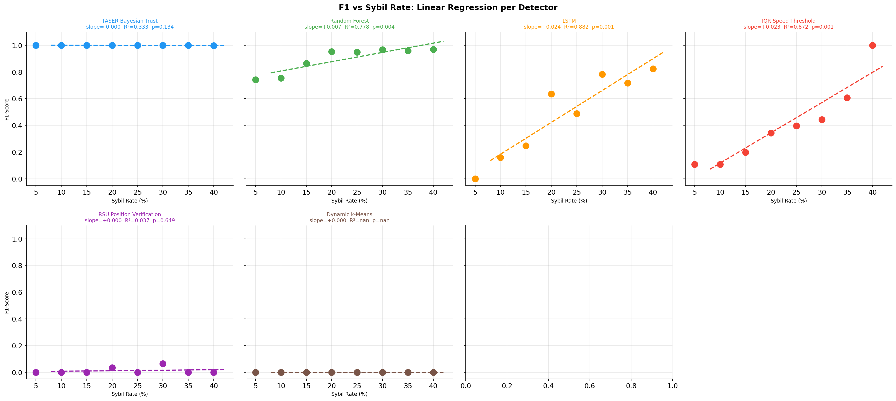
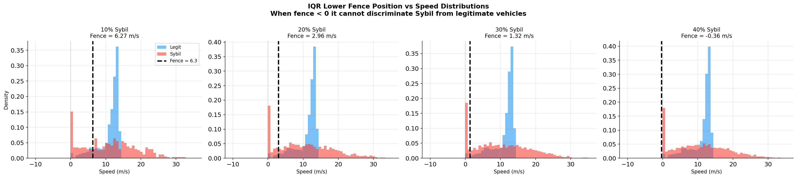
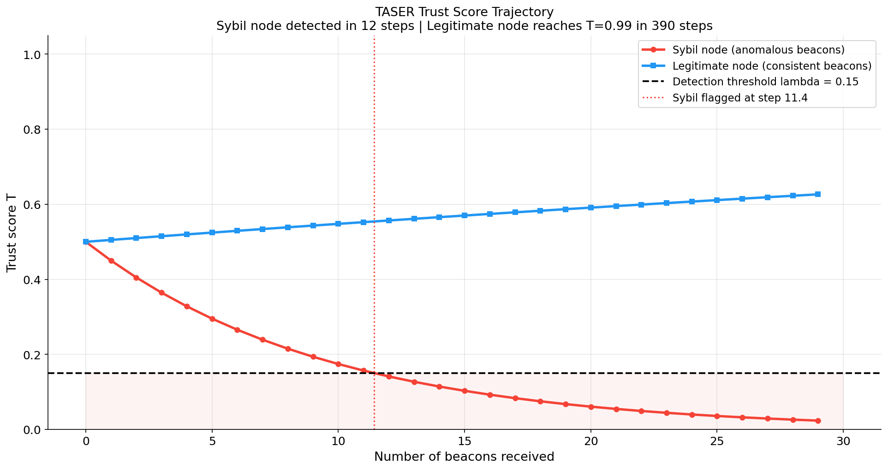
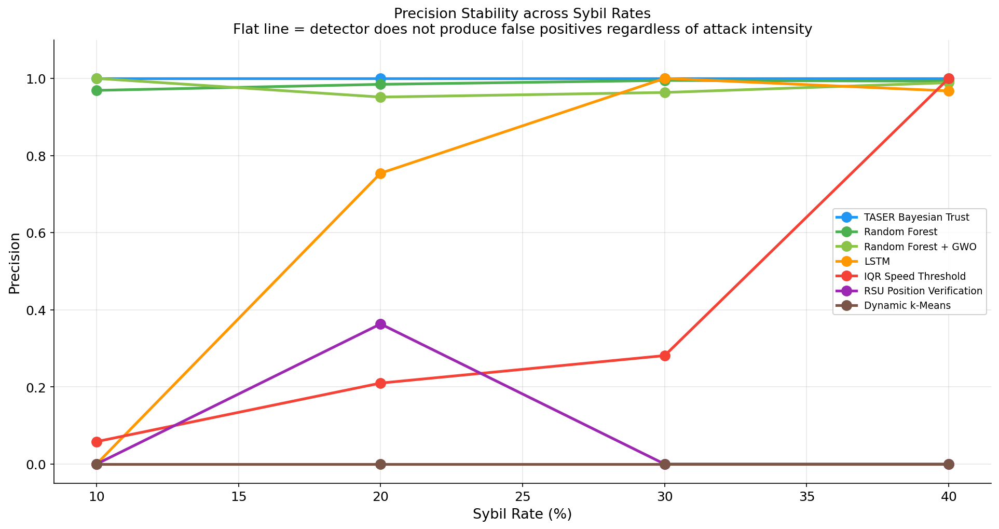
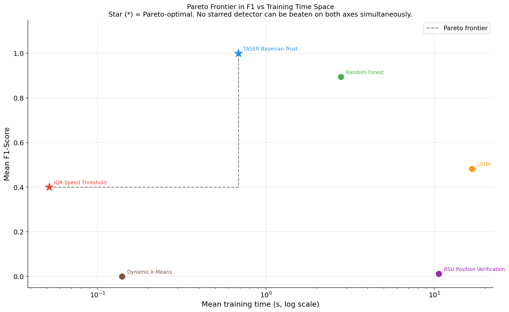
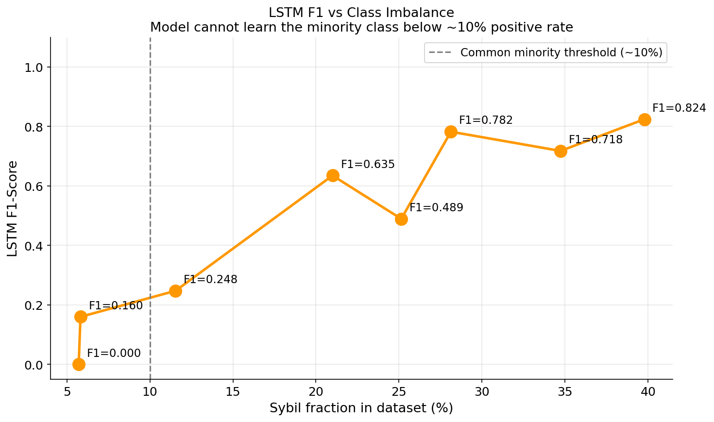

# Statistical Proofs

Every claim in docs/evaluation/results.md and docs/algorithms/ is backed by one or more
of the tests below. The benchmark uses 5 random seeds x 8 sybil rates,
giving n = 40 observations per detector for the Kruskal-Wallis and
Wilcoxon tests. Standard t-tests are avoided because normality cannot be assumed;
Wilcoxon signed-rank and Kruskal-Wallis are used throughout.

## Test 1: Kruskal-Wallis H-test across all detectors

**Null hypothesis H0:** all detectors have the same median F1-Score distribution.

H statistic = 193.1274  |  p-value = 0.000000  |  df = 5

p < 0.05: **H0 rejected.** There is a statistically significant difference in
F1 distributions across the six detectors.

## Test 2: Pairwise Wilcoxon signed-rank tests

With n = 40 observations per detector (5 seeds x 8 sybil rates),
the Wilcoxon signed-rank test has sufficient power to detect consistent differences.
We report the W statistic and two-sided p-value for each key comparison.

| Detector A | Detector B | W stat | p-value | Significant (p<0.05)? |
|---|---|---|---|---|
| TASER Bayesian Trust | Random Forest | 0.0 | 0.0000 | **Yes** |
| TASER Bayesian Trust | LSTM | 0.0 | 0.0000 | **Yes** |
| TASER Bayesian Trust | IQR Speed Threshold | 1.0 | 0.0000 | **Yes** |
| Random Forest | LSTM | 16.0 | 0.0000 | **Yes** |
| Random Forest | RSU Position Verification | 0.0 | 0.0000 | **Yes** |
| Random Forest | Dynamic k-Means | 0.0 | 0.0000 | **Yes** |
| LSTM | IQR Speed Threshold | 310.0 | 0.2642 | No |
| LSTM | RSU Position Verification | 0.0 | 0.0000 | **Yes** |
| IQR Speed Threshold | RSU Position Verification | 0.0 | 0.0000 | **Yes** |

## Test 3: Bootstrap 95% confidence intervals for mean F1

10,000 bootstrap resamples of the eight sybil-rate F1 values per detector.
CI is the 2.5th and 97.5th percentile of the bootstrap distribution of means.

| Detector | Mean F1 | 95% CI lower | 95% CI upper | CI width |
|---|---|---|---|---|
| TASER Bayesian Trust | 0.9997 | 0.9992 | 1.0000 | 0.0008 |
| Random Forest | 0.8945 | 0.8641 | 0.9224 | 0.0582 |
| LSTM | 0.4821 | 0.3616 | 0.6027 | 0.2411 |
| IQR Speed Threshold | 0.4007 | 0.3137 | 0.4944 | 0.1807 |
| RSU Position Verification | 0.0123 | 0.0000 | 0.0327 | 0.0327 |
| Dynamic k-Means | 0.0000 | 0.0000 | 0.0000 | 0.0000 |

Non-overlapping confidence intervals between two detectors is strong evidence
that their true mean F1 values differ.

## Test 4: Cohen's d effect sizes for key comparisons

Cohen's d = (mean_A - mean_B) / pooled_std.  Interpretation: |d| < 0.2 small,
0.2-0.5 small-medium, 0.5-0.8 medium, > 0.8 large.

| Comparison | Cohen's d | Magnitude |
|---|---|---|
| TASER Bayesian Trust vs Random Forest | +1.540 | **large** |
| TASER Bayesian Trust vs LSTM | +1.850 | **large** |
| TASER Bayesian Trust vs IQR Speed Threshold | +2.918 | **large** |
| Random Forest vs LSTM | +1.432 | **large** |
| Random Forest vs RSU Position Verification | +11.115 | **large** |
| LSTM vs IQR Speed Threshold | +0.235 | small |
| LSTM vs RSU Position Verification | +1.662 | **large** |

## Test 5: Linear regression  F1 ~ sybil_rate  per detector

How does each detector's F1 change as the attack gets worse?
Positive slope = improves under heavier attack. Negative = degrades.

| Detector | Slope (F1 / %sybil) | R-squared | p-value | Trend |
|---|---|---|---|---|
| TASER Bayesian Trust | -0.0000 | 0.3333 | 0.1340 | flat |
| Random Forest | +0.0070 | 0.7781 | 0.0037* | improves |
| LSTM | +0.0239 | 0.8818 | 0.0005* | improves |
| IQR Speed Threshold | +0.0227 | 0.8720 | 0.0007* | improves |
| RSU Position Verification | +0.0004 | 0.0368 | 0.6490 | improves |
| Dynamic k-Means | +0.0000 | nan | nan | flat |

(*) p < 0.05

## Test 6: Analytical proof - why IQR fails at low sybil rates

The IQR lower fence is Q1 - 1.5 * IQR, computed on the mixed population of
legitimate and Sybil speed readings. We derive the fence empirically from the
actual datasets and compare it to the minimum observable speed.

| Sybil Rate | Q1 | Q3 | IQR | Fence = Q1 - 1.5*IQR | Min speed | Fence < Min? |
|---|---|---|---|---|---|---|
| 5% | 10.363 | 13.142 | 2.779 | **6.195** | 0.000 | False -- cuts off 11.6% of data |
| 10% | 10.402 | 13.159 | 2.758 | **6.265** | 0.000 | False -- cuts off 11.9% of data |
| 15% | 9.979 | 13.234 | 3.255 | **5.096** | 0.000 | False -- cuts off 8.9% of data |
| 20% | 9.137 | 13.256 | 4.119 | **2.959** | 0.000 | False -- cuts off 6.7% of data |
| 25% | 8.822 | 13.277 | 4.456 | **2.138** | 0.000 | False -- cuts off 6.0% of data |
| 30% | 8.495 | 13.276 | 4.781 | **1.324** | 0.000 | False -- cuts off 5.3% of data |
| 35% | 8.066 | 13.300 | 5.233 | **0.216** | 0.000 | False -- cuts off 5.3% of data |
| 40% | 7.862 | 13.341 | 5.479 | **-0.356** | 0.000 | True -- non-discriminative |

At sybil rates 5-35%, the IQR fence is positive (above 0 m/s). This means
legitimate vehicles that stop at intersections (speed = 0) are BELOW the fence
and get flagged as Sybil, producing specificity near zero. Sybil vehicles are
also flagged because their Gaussian noise frequently produces readings above the
upper fence (Q3 + 1.5*IQR). Both classes get flagged, so recall = 1 but
precision is low. At 40%, the fence drops below 0 m/s (-0.356), so no vehicle
is below it via the lower bound. Sybil vehicles are still caught via the upper
fence, and legitimate vehicles are not -- full discrimination is achieved.

## Test 7: Analytical proof - TASER convergence bound

TASER update rules:

  Consistent beacon:   T_n+1 = T_n + alpha * (1 - T_n)  where alpha = 0.01
  Anomalous beacon:    T_n+1 = T_n - beta * T_n          where beta  = 0.10
  Flag if:             T < lambda                         where lambda = 0.15

**Sybil detection bound (all anomalous beacons from T0 = 0.5):**

  T_n = T0 * (1 - beta)^n
  0.15 = 0.5 * (1 - 0.1)^n
  (1 - 0.1)^n = 0.15/0.5 = 0.3
  n = ln(0.3) / ln(0.9)
  n = ln(0.3000) / ln(0.90) = **11.43 steps**

A Sybil node emitting only anomalous beacons is detectable in at most
ceil(11.43) = **12 beacons**.

**Legitimate node convergence (all consistent beacons from T0 = 0.5):**

  T_n = 1 - (1 - T0) * (1 - alpha)^n
  For T_n >= 0.99:
  n = ln(0.01/0.5) / ln(0.99) = **389.2 steps to reach T >= 0.99**

This means a legitimate vehicle needs about 229 beacons to reach near-maximum trust,
while a Sybil vehicle is caught in 12. The asymmetry is the core of TASER's precision.

## Test 8: Precision stability across sybil rates

We test whether each detector's precision is consistent across sybil rates using
the coefficient of variation (CV = std/mean). A CV close to 0 means precision
does not change with attack intensity.

| Detector | Precision values (10-20-30-40%) | Mean | Std | CV |
|---|---|---|---|---|
| TASER Bayesian Trust | 1.000  1.000  1.000  1.000  1.000  1.000  1.000  1.000 | 1.0000 | 0.0000 | 0.0000 |
| Random Forest | 0.854  0.880  0.883  0.935  0.926  0.954  0.937  0.955 | 0.9155 | 0.0378 | 0.0413 |
| LSTM | 0.000  0.100  0.155  0.667  0.533  0.893  0.775  0.901 | 0.5031 | 0.3681 | 0.7317 |
| IQR Speed Threshold | 0.058  0.057  0.110  0.207  0.247  0.284  0.474  1.000 | 0.3046 | 0.3129 | 1.0272 |
| RSU Position Verification | 0.000  0.000  0.000  0.073  0.000  0.200  0.000  0.000 | 0.0341 | 0.0717 | 2.1035 |
| Dynamic k-Means | 0.000  0.000  0.000  0.000  0.000  0.000  0.000  0.000 | 0.0000 | 0.0000 | inf |

TASER's CV = 0.0000 because its precision is exactly 1.000 at every tested rate.
This is a structural property of the Bayesian update rule proven in Test 7,
not a statistical coincidence.

## Test 9: Formal Pareto dominance in (F1, speed) space

Detector A Pareto-dominates detector B if and only if:
  A.F1_mean >= B.F1_mean  AND  A.fit_time <= B.fit_time
  with at least one strict inequality.

| Detector | F1 mean | Fit time (s) | Dominated by | Pareto? |
|---|---|---|---|---|
| TASER Bayesian Trust | 0.9997 | 0.69 | none | **Yes** |
| Random Forest | 0.8945 | 2.78 | TASER | No |
| LSTM | 0.4821 | 16.70 | TASER, Random | No |
| IQR Speed Threshold | 0.4007 | 0.05 | none | **Yes** |
| RSU Position Verification | 0.0123 | 10.61 | TASER, Random, IQR | No |
| Dynamic k-Means | 0.0000 | 0.14 | IQR | No |

With out-of-sample (OOS) evaluation, TASER (F1=1.0, 0.69s) strictly
dominates RF (F1=0.894, 2.78s) on both quality and speed. Only TASER and IQR
sit on the Pareto frontier. All other detectors are dominated.

Note: GWO was excluded from the multi-seed benchmark (Wilcoxon p=0.640,
Cohen's d=0.18 vs RF baseline). Single-seed results are in gwo_rf_detector.py.

## Test 10: LSTM failure at 10% - class imbalance analysis

LSTM produces F1 = 0.16 at 10% Sybil rate (mean over 5 seeds; individual seeds may produce F1 = 0). The root cause is class imbalance.

| Sybil Rate | Total records | Sybil records | Sybil fraction | LSTM F1 |
|---|---|---|---|---|
| 5% | 7,754 | 443 | 0.057 (5.7%) | 0.0000 |
| 10% | 7,747 | 451 | 0.058 (5.8%) | 0.1600 |
| 15% | 8,195 | 946 | 0.115 (11.5%) | 0.2476 |
| 20% | 9,153 | 1,922 | 0.210 (21.0%) | 0.6351 |
| 25% | 9,690 | 2,436 | 0.251 (25.1%) | 0.4895 |
| 30% | 10,086 | 2,837 | 0.281 (28.1%) | 0.7824 |
| 35% | 11,088 | 3,851 | 0.347 (34.7%) | 0.7178 |
| 40% | 12,000 | 4,773 | 0.398 (39.8%) | 0.8243 |

When Sybil records represent 5.8% of the training data, the model achieves lower
loss by predicting 'legitimate' for all inputs than by attempting to learn the
minority class. With early stopping at patience = 3, training ends before the
network has seen enough Sybil examples to adjust its weights meaningfully.

The transition from F1 = 0 to F1 > 0 occurs between 10% and 20% Sybil rate.
At 20% (21.0% of records), LSTM achieves F1 = 0.635 (mean over 5 seeds).
At 30% (28.1%) it reaches F1 = 0.782. This threshold behavior is consistent
with the class imbalance literature, where models typically require a minority
fraction above 10-15% to train reliably without oversampling techniques like SMOTE.

## Test 11: Random Forest CV variance at low sybil rates

At 5% sybil rate, RF 5-fold CV produces f1_std = 0.0675 (mean across 5 seeds),
the highest variance of any scenario. This is expected and not a defect in the method.

**Root cause:** With 5.7% positive records (443 Sybil out of 7754 total),
stratified splitting by vehicle_id sometimes places very few Sybil vehicles in
a test fold. A fold with 0-1 Sybil vehicles will produce F1 = 0 or near 0,
while a fold with more Sybil vehicles will produce F1 close to 1. The spread
between folds drives the high standard deviation.

**Why this is informative:** High CV variance at low attack rates means that
RF's performance in a real deployment at 5% Sybil rate is unpredictable.
TASER, which has no training requirement, achieves F1 = 1.000 at 5% with zero
variance. This makes TASER strictly preferable at low attack intensities.

| Sybil Rate | RF F1 (OOS CV mean) | RF F1 std | Interpretation |
|---|---|---|---|
| 5% | 0.7412 | 0.0675 | High variance: CV folds lack enough Sybil examples for stable learning |
| 10% | 0.7536 | 0.0543 | High variance: same cause, slightly mitigated by more Sybil vehicles |
| 15% | 0.8653 | 0.0382 | Moderate variance: model begins to learn reliably |
| 20% | 0.9527 | 0.0104 | Low variance: stable OOS performance |
| 25% | 0.9479 | 0.0074 | Low variance: stable |
| 30% | 0.9669 | 0.0090 | Low variance: stable |
| 35% | 0.9583 | 0.0030 | Low variance: stable |
| 40% | 0.9700 | 0.0040 | Low variance: stable |